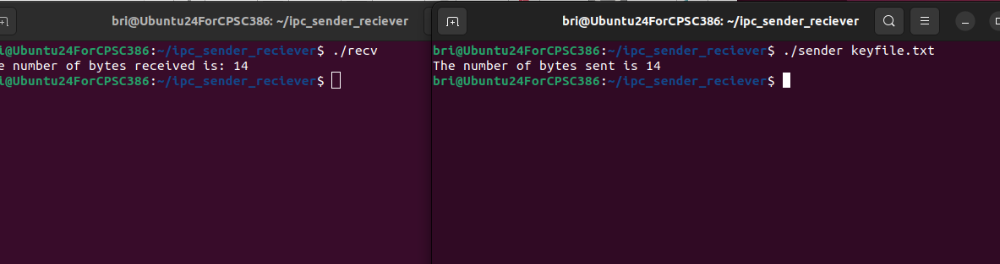
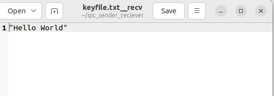

# NAME: Brianna Zaffina
# SECTION#: CPSC 351-01
# EMAIL: zaffinabrianna@csu.fullerton.edu

## HOW TO RUN CODE(FOR LINUX):
1. In your terminal import your files
2. Find the file location and run makefile 
2. Open one termainal and write ./recv
3. Open another terminal and write ./sender keyfile.txt
4. You will get an output of how many bites are in the text file on each terminal
5. Code finished and you now have a new file in your directory called "keyfile.txt__recv" with the text from "keyfile.txt" inside of it.

## VISUAL EXAMPLE:
This is how you should run the files on your terminal and what it will look like:

This is what the new file contains (Contains quotes because thats how it has it in the keyfile.txt):

